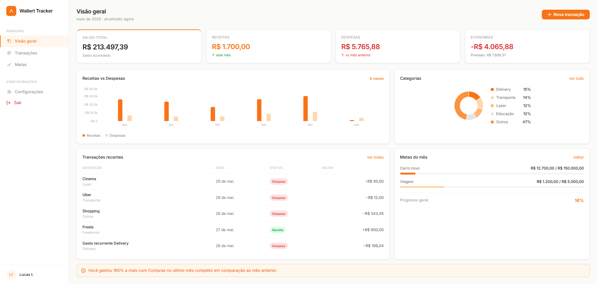
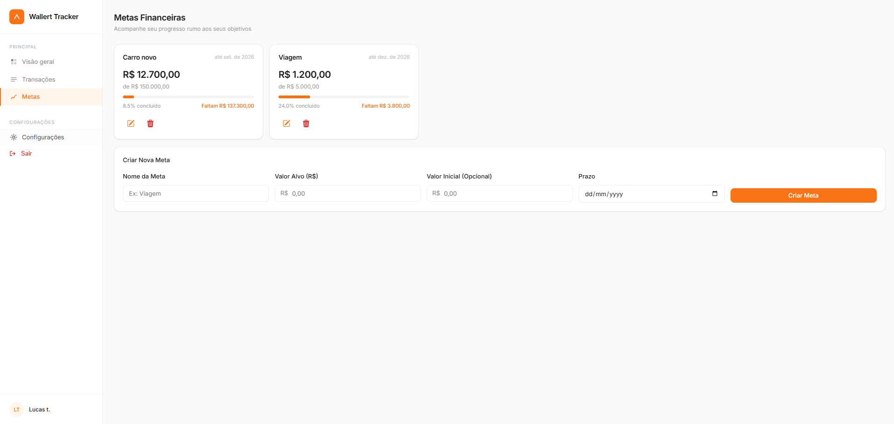
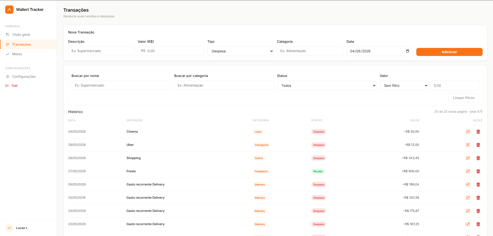

# Wallert Tracker

O **Wallert Tracker** é uma aplicação de controle financeiro pessoal para gerenciamento de **receitas, despesas e metas**, com autenticação por usuário e dashboard com visão consolidada dos dados.



## Índice

- [Wallert Tracker](#wallert-tracker)
  - [Índice](#índice)
  - [1. Sobre a aplicação](#1-sobre-a-aplicação)
    - [Tela de Metas](#tela-de-metas)
    - [Tela de Transações](#tela-de-transações)
  - [2. Funcionalidades](#2-funcionalidades)
  - [3. Estrutura do projeto e arquitetura](#3-estrutura-do-projeto-e-arquitetura)
    - [Arquitetura utilizada](#arquitetura-utilizada)
      - [Backend (arquitetura em camadas)](#backend-arquitetura-em-camadas)
      - [Frontend (arquitetura por features/telas)](#frontend-arquitetura-por-featurestelas)
  - [4. Tecnologias e bibliotecas](#4-tecnologias-e-bibliotecas)
    - [Frontend](#frontend)
    - [Backend](#backend)
  - [5. Como executar o projeto](#5-como-executar-o-projeto)
    - [Pré-requisitos](#pré-requisitos)
    - [1. Subir banco de dados](#1-subir-banco-de-dados)
    - [2. Configurar variáveis do backend](#2-configurar-variáveis-do-backend)
    - [3. Instalar dependências do frontend](#3-instalar-dependências-do-frontend)
    - [4. Iniciar backend](#4-iniciar-backend)
    - [5. Iniciar frontend](#5-iniciar-frontend)

## 1. Sobre a aplicação

O Wallert Tracker foi desenvolvido para ajudar no acompanhamento da vida financeira por usuário, com foco em organização, previsibilidade e evolução contínua dos hábitos financeiros.

Na aplicação, o usuário encontra uma experiência dividida por telas principais:

- **Dashboard**: visão consolidada com saldo atual, evolução mensal das despesas, previsão de gastos e alertas de comportamento por categoria;
- **Transações**: tela para registrar receitas e despesas, editar lançamentos e manter o histórico financeiro atualizado;
- **Metas**: área dedicada ao planejamento financeiro, permitindo criar objetivos, acompanhar progresso e manter o foco em resultados.

Além do controle diário, o sistema oferece recursos analíticos para apoiar decisões com base no próprio histórico financeiro.

### Tela de Metas



Nesta tela, o usuário pode cadastrar e acompanhar metas financeiras pessoais, visualizando o andamento de cada objetivo para facilitar o planejamento de curto, médio e longo prazo.

### Tela de Transações



Na tela de transações, é possível registrar entradas e saídas, classificar por categoria e manter um histórico organizado para análises e ajustes de orçamento.

Entre os principais recursos do projeto, destacam-se:

- registro de transações (entrada e saída);
- organização por categorias;
- análise de comportamento de gastos;
- acompanhamento de metas financeiras.

Cada conta possui dados isolados, garantindo que transações e configurações fiquem associadas ao usuário autenticado.

## 2. Funcionalidades

- Cadastro e login de usuários com JWT.
- Configuração inicial da conta (salário, saldo inicial, categorias extras, receita automática).
- CRUD de transações:
  - criar;
  - listar;
  - editar;
  - excluir.
- Gestão de metas financeiras.
- Dashboard com:
  - saldo atual;
  - previsão de gastos (suavização exponencial);
  - insights de aumento de gastos por categoria;
  - evolução mensal de despesas.

## 3. Estrutura do projeto e arquitetura

O projeto está organizado em dois módulos principais:

```text
wallert-tracker/
├── backend/      # API REST (Spring Boot)
├── frontend/     # SPA (React + Vite + TypeScript)
└── docker-compose.yml  # PostgreSQL
```

### Arquitetura utilizada

#### Backend (arquitetura em camadas)

- **Controller**: expõe endpoints REST e valida acesso por usuário autenticado.
- **Service**: concentra regras de negócio (insights e previsão).
- **Repository**: acesso a dados via Spring Data JPA.
- **Model**: entidades JPA.
- **Security**: autenticação/autorização com JWT e Spring Security stateless.

#### Frontend (arquitetura por features/telas)

- **Pages/Components** para Dashboard, Transações, Metas, Login, Cadastro e Configurações.
- **Context API (`AuthContext`)** para estado de autenticação e token.
- **Cliente HTTP central (`services/api.ts`)** com interceptor para envio automático do token JWT.

## 4. Tecnologias e bibliotecas

### Frontend

- React 18
- TypeScript
- Vite
- React Router DOM
- Axios
- Recharts
- Lucide React

### Backend

- Java 21
- Spring Boot 3
- Spring Web
- Spring Data JPA
- Spring Security
- JWT (JJWT)
- PostgreSQL
- Maven
- Lombok

## 5. Como executar o projeto

### Pré-requisitos

- Node.js + npm
- Java 21
- Maven
- Docker + Docker Compose

### 1. Subir banco de dados

Na raiz do projeto:

```bash
docker compose up -d
```

### 2. Configurar variáveis do backend

No diretório `backend`, copie o arquivo de exemplo e ajuste se necessário:

```bash
cd backend
cp .env.example .env
```

### 3. Instalar dependências do frontend

```bash
cd ../frontend
npm install
```

### 4. Iniciar backend

```bash
cd ../backend
mvn spring-boot:run
```

API padrão: `http://localhost:8080`

### 5. Iniciar frontend

Em outro terminal:

```bash
cd frontend
npm run dev
```

Aplicação web: `http://localhost:5173`
